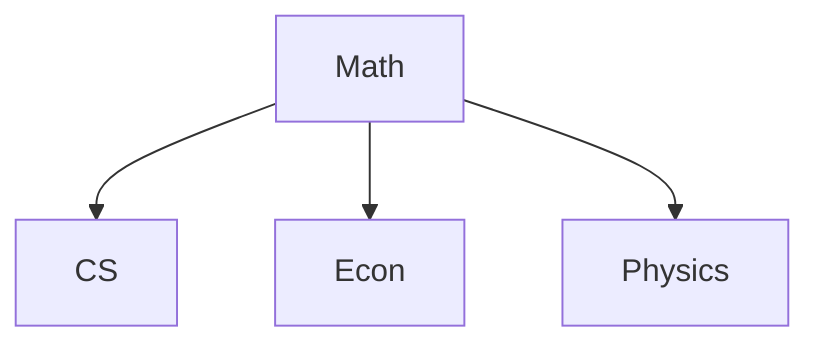

## Overview

1. Here are the courses that I learned from Ecole Polytechnique and ESSEC, I seperate them into several parts. Also you can find some really useful information and material in this parts.

## Courses
#### MAA201 - Reduction of Endomorphisms (Abstract Algebra)
- *Introduction:* In this course we will introduce the basic concepts in abstract algebra.
  - Basic notions of groups, rings and their ideals, commutative fields (3 weeks)
  - arithmetics of the set of integers, ideals of the set of integers (2 weeks)
  - Basic notions of polynomials, Euclidean division (d’Alembert-Gauss fundamental theorem of algebra is admitted) (2 weeks)
  - Basic matrix reduction: eigenvalues, eigenspaces, characteristic polynomial, diagonalization and trigonalization (4 weeks)
  - Advanced matrix reduction: minimal polynomial, the kernel lemma, characteristic spaces, Cayley-Hamilton theorem, Dunford reduction of a matrix. No Jordan reduction (3 weeks) 
- *Reference:* Here is the course page of [Algèbre et arithmétique](https://webusers.imj-prg.fr/~jan.nekovar/co/algar/) from Sorbonne University second year course. The textbook in this courses in really detailed in explaination and information, also more organized. You can also find some TD in the course page but however is much easier than the Exercise at l'X.

#### MAA202 - Topology and Multivariables Calculus
- *Introduction:* The goal of this course is to extend notions of analysis in $\mathbf{R}$, $\mathbf{C}$ and of calculus in $\mathbf{R}$ seen in the first year (mainly in MAA102 and MAA105) to notions of analysis in normed vector spaces and of calculus in $\mathbf{R}^d$, $d\in \mathbf{N}$. Throughout the semester we will discuss the following topics:
  - topology, convergence of sequences, continuity and compactness;
  - important properties concerning the particular case of finite dimensional vector spaces,
  - differentiability in finite dimensional vector spaces and tools to compute the extrema of functions of several variables,
  - some notions of integrals of functions of several variables.
- *Reference:*

#### MAA203 - Introduction to Statistics
- *Introduction:* This is the introduction course of probability and statistics at Ecole Polytechnique. In bachelor program of Ecole Polytechnique, you will learn statistics later after this course and in third year you will learn about Asymptotic Statistics provided by [Prof. E. Moulines](https://en.wikipedia.org/wiki/%C3%89ric_Moulines) and Stochastic Processes by [Prof. T. Mastrolia](https://ieor.berkeley.edu/people/thibaut-mastrolia/). You can find some important information and material which is helpful for this course.
- *Chapters:* Here are the chapters of this course.
  - **Chapter 1 - Discrete Probability Spaces:** In this chapter, you will know the definition and basic concept of DPS, also we will introduce some combinatorial calculus and conditioning, independence those baisc knowledge in Probability.
  - **Chapter 2 - Random Variables:** The main content of this chapter is about some basic concepts of RV in DPS, such as Joint densites and marginal densitis, expecation, Variance, Covariance, PDF, CDF, MGF of the random variable. Also we will try to see $L^{P}$ spaces this concept in this chapter.
  - **Chapter 3 - General Probability spaces adn random variables:** Since in the last chapter we only discuss the situation in DPS. In this chapter we will expend those concepts into absolution continuous random variables.
  - **Chapter 4 - Convergence of random variables and law of large numbers:** For the last chapter, we will introduce different types convergence for absolute continuous variable and learn about laws of large numbers. Also we will talk a little bit about Monte carlo methods at the end of the courses.
- *Reference:* The professor of this course is the worst that I ever seen in l'X. So I collected some material that might be helpful. The first note in written by me which contains most important definition and proposition of the course. Also I add some extra important points or conclusion I learned while I do the TD and cheat sheet of Expectatioin, variance, CDF, PDF, MGF of common distributions. You can find the notes from this [link](). Also, I have some recommendation of material for this course. You can find [概率论与数理统计（浙大第四版)](https://github.com/xitongsys/ML/blob/master/books/%E6%A6%82%E7%8E%87%E8%AE%BA%E4%B8%8E%E6%95%B0%E7%90%86%E7%BB%9F%E8%AE%A1(%E6%B5%99%E5%A4%A7%E5%9B%9B%E7%89%88).pdf) and [A First Course in Prabability](http://julio.staff.ipb.ac.id/files/2015/02/Ross_8th_ed_English.pdf) by Sheldon Ross. All of them are really classical textbook for probability. However, MAA203 in l'X is really theoretical and you have to prove a lot basic definition or proposition in thie course. Also, you can find this [Textbook](http://gerin.perso.math.cnrs.fr/Enseignements/PolyX-HEC.pdf) from X-HEC DSBA program by [Lucas Gerin](http://gerin.perso.math.cnrs.fr/) who is also our professor for MAA205-Algorithms for Discrete Mathematics. And here is my [notes](https://drive.google.com/file/d/18M1Wr7A3tkJwDE0gYl8pPRmwUeL3IOe4/view?usp=sharing) which collected all the basic concepts and important proposition from courses and exercises and a [collection of concepts](https://scholar.harvard.edu/files/charlescywang/files/basic_statistics_and_probability_for_econometrics_econ_270a.pdf) in probability and statistics from Harvard University which is really useful.

#### CSE203 - Proof and Logic (Formal Language 1 - Coq and OCaml Programming)
- *Introduction:*
- *Reference:* Since it's really hard to get some good material explaining $Coq$. You can find [this material](https://www.cs.cornell.edu/courses/cs3110/2018sp/a5/coq-tactics-cheatsheet.html) provided by Cornell. Also you can find [CS3110 - OCaml Programming: Correct + Efficient + Beautiful](https://cs3110.github.io/textbook/cover.html) from Cornell University which is much more comprehensive and organized courses about $Coq$ and $OCaml$.

#### Pure Mathematics and Applied Mathematics

<table class="tg" style="undefined;table-layout: fixed; width: 720px">
<colgroup>
<col style="width: 65px">
<col style="width: 429px">
<col style="width: 204px">
</colgroup>
<thead>
  <tr>
    <th class="tg-c3ow">Number</th>
    <th class="tg-c3ow">Courses</th>
    <th class="tg-c3ow">Professor</th>
  </tr>
</thead>
<tbody>
  <tr>
    <td class="tg-c3ow">MAA101</td>
    <td class="tg-c3ow">Linear Algebra  </td>
    <td class="tg-c3ow">Stéphane Bijakowski</td>
  </tr>
  <tr>
    <td class="tg-c3ow">MAA102</td>
    <td class="tg-c3ow">Mathematical Analysis 1</td>
    <td class="tg-c3ow">Frank Pacard</td>
  </tr>
  <tr>
    <td class="tg-c3ow">MAA103</td>
    <td class="tg-c3ow">Discrete Mathematics 2</td>
    <td class="tg-c3ow">Alouges François</td>
  </tr>
  <tr>
    <td class="tg-baqh">MAA105</td>
    <td class="tg-baqh">Mathematical Anlysis 2: Integral and Differential Calculus</td>
    <td class="tg-baqh">Jérémie Bettinelli</td>
  </tr>
  <tr>
    <td class="tg-baqh">MAA106</td>
    <td class="tg-baqh">Introduction to Numerical Analysis</td>
    <td class="tg-baqh">Breden Maxime</td>
  </tr>
  <tr>
    <td class="tg-baqh">LAB101</td>
    <td class="tg-baqh">Calculus</td>
    <td class="tg-baqh">Guin Laurent</td>
  </tr>
  <tr>
    <td class="tg-baqh">LAB102</td>
    <td class="tg-baqh">Discrete Mathematics 1</td>
    <td class="tg-baqh">Sabin Julien</td>
  </tr>
  <tr>
    <td class="tg-baqh">LAB151</td>
    <td class="tg-baqh">Vector and Fouier Analysis</td>
    <td class="tg-baqh">Le Hur Karine &amp; Goutéraux Blaise</td>
  </tr>
  <tr>
    <td class="tg-baqh">MAA201</td>
    <td class="tg-baqh">Reduction of endomorphisms</td>
    <td class="tg-baqh">N/A</td>
  </tr>
  <tr>
    <td class="tg-baqh">MAA202</td>
    <td class="tg-baqh">Topology and multivariable calculus</td>
    <td class="tg-baqh">Anne-Sophie de Suzzoni</td>
  </tr>
  <tr>
    <td class="tg-baqh">MAA203</td>
    <td class="tg-baqh">Introduction to Probability</td>
    <td class="tg-baqh">Giovanni Conforti</td>
  </tr>
  <tr>
    <td class="tg-baqh">MAA204</td>
    <td class="tg-baqh">Introduction to Statistics</td>
    <td class="tg-baqh">D. Métivier</td>
  </tr>
  <tr>
    <td class="tg-baqh">MAA205</td>
    <td class="tg-baqh">Algorithms for Discrete Mathematics</td>
    <td class="tg-baqh">LUCAS GERIN</td>
  </tr>
  <tr>
    <td class="tg-baqh">MAA206</td>
    <td class="tg-baqh">Quadratic Forms and Applications</td>
    <td class="tg-baqh">Annalaura Stingo</td>
  </tr>
  <tr>
    <td class="tg-baqh">MAA207</td>
    <td class="tg-baqh">Series of Functions, Differential Equations</td>
    <td class="tg-baqh">N/A</td>
  </tr>
  <tr>
    <td class="tg-baqh">MAA208</td>
    <td class="tg-baqh">Numerical Linear Algebra</td>
    <td class="tg-baqh">Teddy Pichard</td>
  </tr>
  <tr>
    <td class="tg-baqh">MAA209</td>
    <td class="tg-baqh">A First Step in Numerical Optimization</td>
    <td class="tg-baqh">Beniamin Bogosel</td>
  </tr>
</tbody>
</table>

#### Computer Sciences

<table class="tg" style="undefined;table-layout: fixed; width:720px">
<colgroup>
<col style="width: 65px">
<col style="width: 329px">
<col style="width: 204px">
</colgroup>
<thead>
  <tr>
    <th class="tg-c3ow">Number</th>
    <th class="tg-c3ow">Courses</th>
    <th class="tg-c3ow">Professor</th>
  </tr>
</thead>
<tbody>
  <tr>
    <td class="tg-c3ow">CSE101</td>
    <td class="tg-c3ow">Computer Programming</td>
    <td class="tg-c3ow">Smith Benjamin</td>
  </tr>
  <tr>
    <td class="tg-c3ow">CSE102</td>
    <td class="tg-c3ow">Advanced Programming</td>
    <td class="tg-c3ow">Pierre-Yves Strub</td>
  </tr>
  <tr>
    <td class="tg-c3ow">CSE103</td>
    <td class="tg-c3ow">Introduction to Algorithms</td>
    <td class="tg-c3ow">Damiano Mazza</td>
  </tr>
  <tr>
    <td class="tg-c3ow">CSE104</td>
    <td class="tg-c3ow">Web Programming</td>
    <td class="tg-c3ow">Rohmer Damien</td>
  </tr>
  <tr>
    <td class="tg-baqh">CSE201</td>
    <td class="tg-baqh">Objected-Oriented Programming in C++</td>
    <td class="tg-baqh">Stephane Redon</td>
  </tr>
  <tr>
    <td class="tg-baqh">CSE202</td>
    <td class="tg-baqh">Design and Analysis of Algorithms</td>
    <td class="tg-baqh">Bruno Salvy</td>
  </tr>
  <tr>
    <td class="tg-baqh">CSE203</td>
    <td class="tg-baqh">Logic and Prove</td>
    <td class="tg-baqh">Pierre-Yves Strub</td>
  </tr>
  <tr>
    <td class="tg-baqh">CSE204</td>
    <td class="tg-baqh">Machine Learning</td>
    <td class="tg-baqh">Jesse Read</td>
  </tr>
  <tr>
    <td class="tg-baqh">CSE205</td>
    <td class="tg-baqh">Computer Architechture</td>
    <td class="tg-baqh">Bourke Timothy</td>
  </tr>
  <tr>
    <td class="tg-baqh">CSE206</td>
    <td class="tg-baqh">Introduction to Formal Languages</td>
    <td class="tg-baqh">N/A</td>
  </tr>
</tbody>
</table>

#### Economic & Finance, Physics, Social Courses

<table class="tg" style="undefined;table-layout: fixed; width: 720px">
<colgroup>
<col style="width: 65px">
<col style="width: 329px">
<col style="width: 204px">
</colgroup>
<thead>
  <tr>
    <th class="tg-c3ow">Number</th>
    <th class="tg-c3ow">Courses</th>
    <th class="tg-c3ow">Professor</th>
  </tr>
</thead>
<tbody>
  <tr>
    <td class="tg-c3ow">ECO101</td>
    <td class="tg-c3ow">Introduction to Microeconomics and Macroeconomics</td>
    <td class="tg-c3ow">Yukio Koriyama &amp; Jean-Baptiste Michau</td>
  </tr>
  <tr>
    <td class="tg-c3ow">ECO102</td>
    <td class="tg-c3ow">Topics in Economics</td>
    <td class="tg-c3ow">Schmutz Benoit &amp; Barrows Geoffery Masters</td>
  </tr>
  <tr>
    <td class="tg-c3ow">ECO204</td>
    <td class="tg-c3ow">Introduction to Finance</td>
    <td class="tg-c3ow">N/A</td>
  </tr>
  <tr>
    <td class="tg-baqh">PHY101</td>
    <td class="tg-baqh">Mechanics and Heat</td>
    <td class="tg-baqh">Ramananarivo Sophie</td>
  </tr>
  <tr>
    <td class="tg-baqh">LAB103</td>
    <td class="tg-baqh">Introduction to Experiement</td>
    <td class="tg-baqh">NA</td>
  </tr>
  <tr>
    <td class="tg-baqh">HSS151</td>
    <td class="tg-baqh">French Identity</td>
    <td class="tg-baqh">Renaudeau Pierre-Marc</td>
  </tr>
  <tr>
    <td class="tg-baqh">HSS102</td>
    <td class="tg-baqh">Geopolitics in Ceberspace</td>
    <td class="tg-baqh">Louis Pétiniaud</td>
  </tr>
</tbody>
</table>