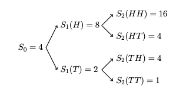

## Abstract

The objective is to study how can we apply binomial models in the pricing of some financial products like saving, stocks and options.

In the first part of the project we discuss more general situations about the non-risky products like savings and risky products like stocks which evolve randomly with respect to time. Then in the second part of the project, we gonna discuss options in different time periods and give the general case with more details.

At the end of the project, we give another expression and our conclusion and remarks.

---

## General assumptions and underlying models

To begin with, we assume that all the financial assets in our problem can be infinitely divided. Also, we regard that they can be sold even if the agent does not have them. That is, we can own actually negative units of a certain financial asset. In our project, we will always consider a simple financial market that only contains the following three types of financial assets:

1. **Non-risky products (savings in particular) with an interest $r$.**

2. **Risky products (stocks in particular) which evolves randomly with respect to time.**
   We can model the price of stocks (denoted by S) in the following way. Assume at each step, the price will either be multiplied by a scalar u ($ u \geq 1$), or be multiplied by another scalar d ($d \leq 1$). To note that  this process is assumed to be perfectly fair. That is to say, the price will either go through a fixed rising process or a fixed decreasing process and the probability of which is equal. We denote the rising process as  H  and the decreasing process as  T  and use them to manifest the index of the price. For instance, if the price first went up, then went down for successively two times, we can denote the index as (H, T, T). The figure below gives a more complete example. We will denote $\Omega$ as the set of all the possible indices at the last stage involved in the process. We have:
   
   $$
   \Omega=\left\{\begin{array}{l}
   \{H H, H T, T H, T T\}, \text { after two steps } \\
   \{H H H, H H T, H T H, H T T, T H H, T H T, T T H, T T T\}, \text { after three steps }
   \end{array}\right.
   $$
   
   If $\omega$ is an element of $\Omega$, we will denote $\omega_{k}$ as the $k^{th}$ component of $\omega$. The price of the stock with all the possible outcomes up to two steps with $S_0=4$, $u=2$ and $d=\frac{1}{2}$ is given below:
   
   Here $S_n(\omega)=p \times S_{n-1}(\omega-\omega_n)$, where $p=2$ if ${\omega_n}=H$ and $p=\frac{1}{2}$ if ${\omega_n}=T$.

3. **Another risky product: option.**

   We will consider a European option, which is, by definition, a version of an options contract that limits execution to its expiration date. In other words, if the underlying security has moved in price, an investor would not be able to exercise the option early and take delivery of or sell the shares. If the strike price of an option is denoted by K and the expiration is n years, our final payoff of such a call option denoted by $V_{n}$ will satisfy that $V_{n}(\omega) = max\{0, S_{n}(\omega)-K\}$. Indeed, under an index $\omega$ of the stock price, if the price is higher than the strike price, we will sell the stocks and get some money, if the price is lower than the strike price, the best choice is obviously to do nothing as one will lose money otherwise.

---
## Copyright

Copyright by `Yubo Cai`, `Tianli Xu`, `Zhuoya Zhang`

```

```
